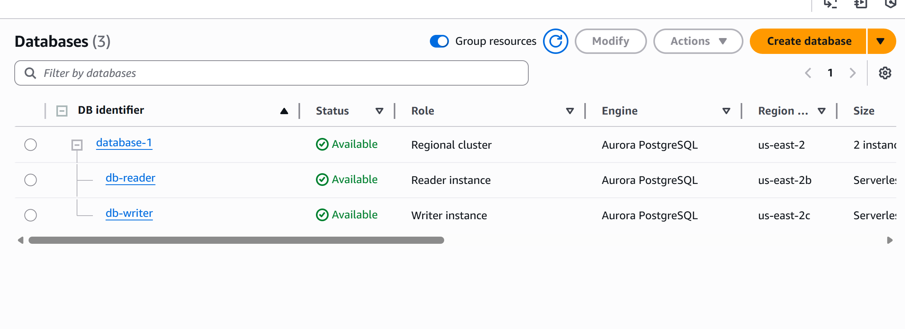
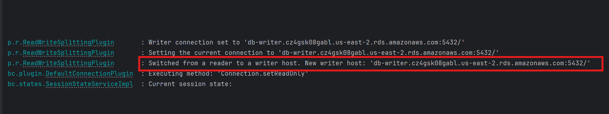

# Aurora Read/Write Splitting POC with IAM Authentication

This is a Spring Boot proof-of-concept (POC) to validate whether the [AWS Advanced JDBC Wrapper](https://github.com/awslabs/aws-advanced-jdbc-wrapper) correctly routes **read** and **write** operations to the appropriate Aurora PostgreSQL replicas using the `readWriteSplitting` plugin and **IAM authentication**.

---

## ✅ Goals

- Test if `@Transactional(readOnly = true)` uses the **reader endpoint**
- Use IAM to authenticate to Aurora instead of passwords
- Log which host (reader or writer) was used for each query

---

## 📸 Screenshots of the results

- **Aurora cluster with replicas in AWS Console**



- **Application log (Reader Connection):**


- **Application log (Writer Connection):**

  

- **Application log (Reader-Writer switch Connection):**

  


---

## 🛠️ Setup

### 1. IAM Permissions

Attach this policy to your IAM user or role:

```json
{
  "Effect": "Allow",
  "Action": "rds-db:connect",
  "Resource": "arn:aws:rds-db:us-east-2:<account-id>:dbuser:<cluster-resource-id>/db_user"
}
```

### 2. Create DB user and table

Connect to Aurora as master user and run:

```sql
CREATE USER db_user; 
GRANT rds_iam TO db_user;

CREATE TABLE test_data (
  id SERIAL PRIMARY KEY,
  value TEXT
);

GRANT USAGE ON SCHEMA public TO "db_user";
GRANT SELECT, INSERT, UPDATE, DELETE ON ALL TABLES IN SCHEMA public TO "db_user";
```

---

## ▶️ Running the App

Make sure you provide AWS credentials (via env vars or `System.setProperty(...)`):

```java
System.setProperty("aws.accessKeyId", "...");
System.setProperty("aws.secretAccessKey", "...");
```

The app will:

1. Write a row to the DB (uses writer)
2. Read rows from the DB (uses reader if `@Transactional(readOnly = true)` works)

---

## 🔧 Relevant Code

**Plugin config:**

```java
props.setProperty("plugins", "readWriteSplitting,iam");
props.setProperty("user", "db_user");
```

## Conclusion

This POC successfully confirmed that read and write operations were routed to the correct Aurora replicas by combining @Transactional(readOnly = true) in Spring with the AWS JDBC driver (readWriteSplitting plugin) and IAM passwordless authentication.


## References

- [AWS Advanced JDBC Wrapper](https://github.com/awslabs/aws-advanced-jdbc-wrapper)
- [Aurora IAM Authentication](https://docs.aws.amazon.com/AmazonRDS/latest/UserGuide/UsingWithRDS.IAMDBAuth.html)
